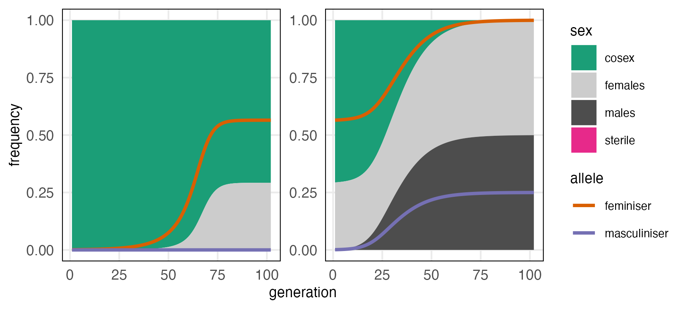

# One-factor sex determination evolves without linkage between feminising and masculinising mutations

Scripts to replicate figures and numerical analysis in [DOI:10.1098/rspb.2024.0693](https://doi.org/10.1098/rspb.2024.0693). 

## Dependencies

* These scripts were created using R version 4.1.0, which will need to be [installed](https://cran.r-project.org/doc/manuals/r-patched/R-admin.html)
* The R packages used for manipulating data and creating figures are listed in scripts/functions.R. These packages can be installed from within R using

```
install.packages(c("readr", "stringr", "dplyr", "tidyr", "ggplot2", "viridis", "ggpubr", "ggtext"))
```

## Example

We provide an [example script](scripts/example.R) that will numerically iterate invasion by a feminiser and then a masculiniser. You can edit the parameters in this file to explore different parameter combinations. This script produces a plot of transitions from cosexuality (hermaphroditism) to dioecy (separate males and females) like this:



## Generate Figures

The scripts used to generate the three figures in the paper are 
* [figure 1 script](scripts/fig1.R)
* [figure 2 script](scripts/fig2.R)
* [figure 3 script](scripts/fig3.R)
We have provided the data to make these figures in [results/simulations](results/simulations/).

## Regenerate Figure Data

The scripts used to run simulations to create the data in the figures are
* [create figure 2 data](scripts/create_fig2_data.R), which is not computationally demanding and can be run locally. 
* [create figure 3 data](scripts/create_fig3_data.sh), which calls three subscripts that were submitted to an HPC cluster with a SLURM scheduler
    * [create parameter combinations](scripts/create_fig3.data1.sub), which has a short embedded R script to generate the parameter combinations 
    * [run simulations](scripts/create_fig3_data2.sub), which submits parallel array jobs that call an [R script](scripts/create_fig3_data2.R).
    * [combine results](scripts/create_fig3_data3.sub), which contains a short embedded R script to combine the final allele frequencies into a [table](results/simulations/fig3_final_frequencies.tsv). 

## Author

Michael F Scott

## Reference

[DOI:10.1098/rspb.2024.0693](https://doi.org/10.1098/rspb.2024.0693)
